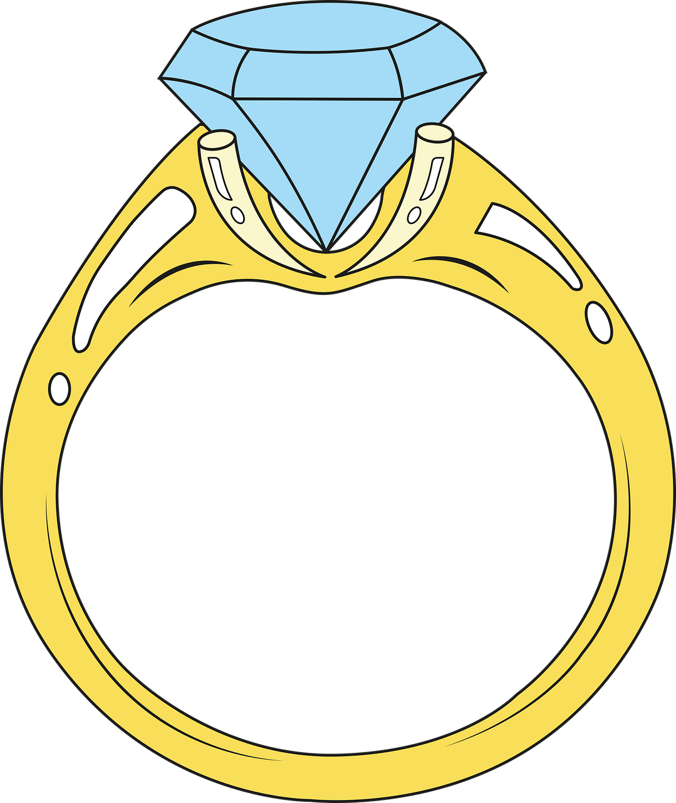
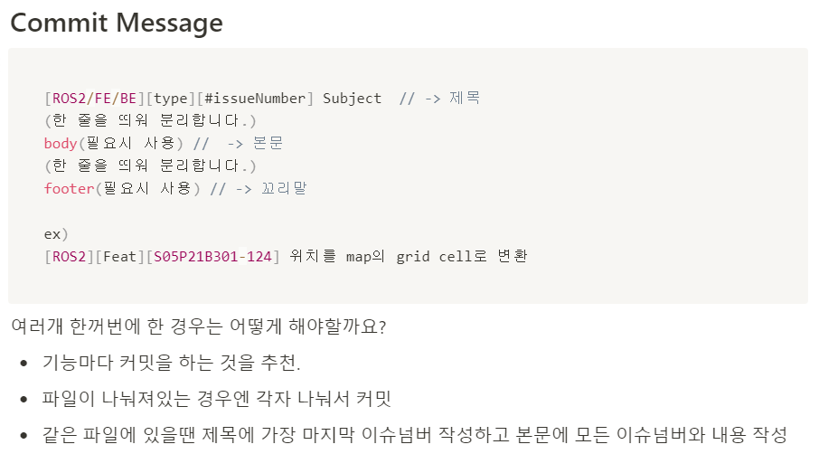
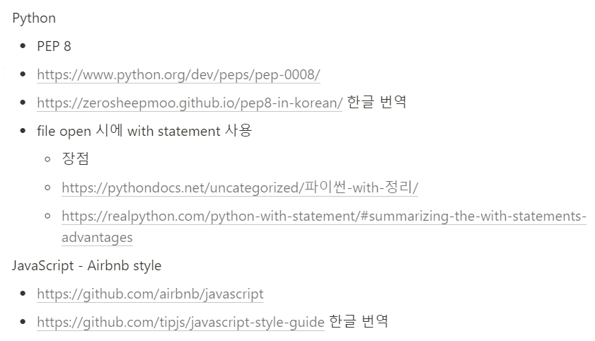
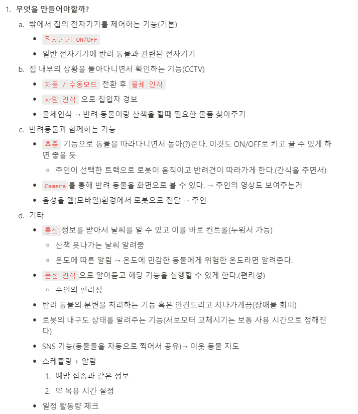
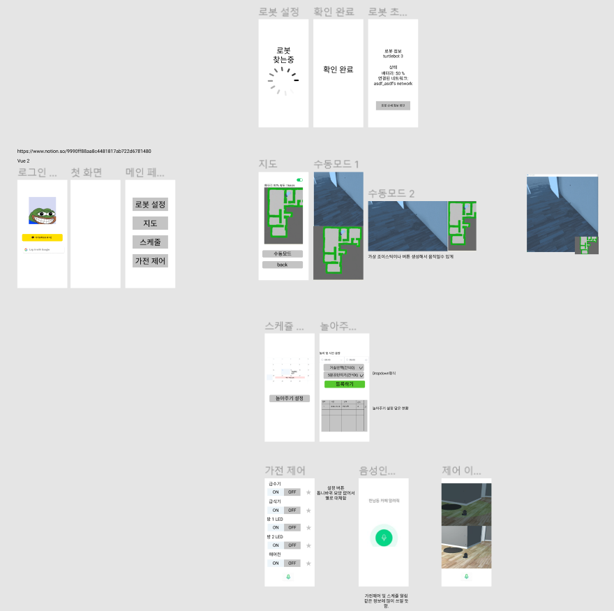

# 반지

 

 

**1인가구와 반려동물을 위한 스마트홈 서비스**

**프로젝트 기간 : 2021.08.23 ~ 2021.10.08**

   

   

 

## 개발환경

### ROS

- ROS eloquent (20200124 release)
- python 3.7.5
- openssl 1.0.2u
- choco 0.10.15
- opencv 3.4.6
- choco 0.10.15
- opencv 3.4.6
- rti 5.3.1
- opensplice 6.9.190403

### tensorflow

- tensorflow 1.15
- CUDA Toolkit 10.0
- cnDNN 7.6.4

 

## 개발자

 팀장 고동건

 팀원 양준서

 팀원 이광교

 팀원 이진영

 팀원 정대진

 팀원 천주용

 

## 프로젝트 소개

**1인가구**가 증가하는 사회에서 집에 남아있는 **반려동물과의 소통, 안전**을 위한 **스마트홈 서비스**

### 목적

- 반려동물이 증가하지만 함께 보내는 시간이 부족한 사회에서 실시간 영상을 통해 반려동물을 볼 수 있고 알맞은 환경을 조정할 수 있다. 
- 바쁜 사회에서 원격으로 집의 가전제품을 제어하여 편리함을 준다.
- 실시간 영상을 이용하여 방범 CCTV역할을 한다.

 

## 사전학습

[IoT](https://github.com/kwanggyo/IoT)

 

## 협업 규칙

### Git Convention

### Code Convention

 

## 기획

### 아이디어 회의

- 음성인식 기능과 SNS 공유 기능은 추가 개발시 진행 예정

### 와이어프레임

### ERD

- DB를 이용하지 않고 소켓통신으로 구현하였다

### 아키텍쳐

 

## 개발현황

